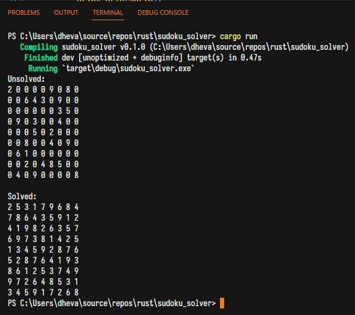

# rust-sudoku-solver
A CLI sudoku solver written in Rust.

Adapted from https://stackoverflow.com/questions/19022739/sudoku-solver-in-c

# How to use
Run `cargo run` from the root directory.

The program detects `sudoku.txt` at working directory and will attempt to solve it.

